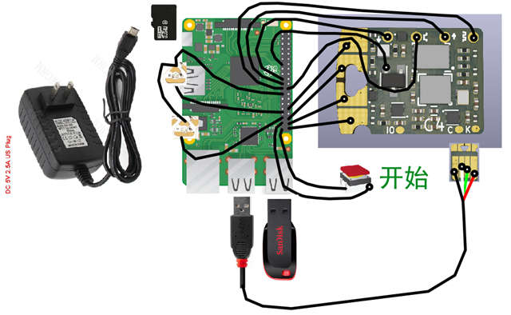
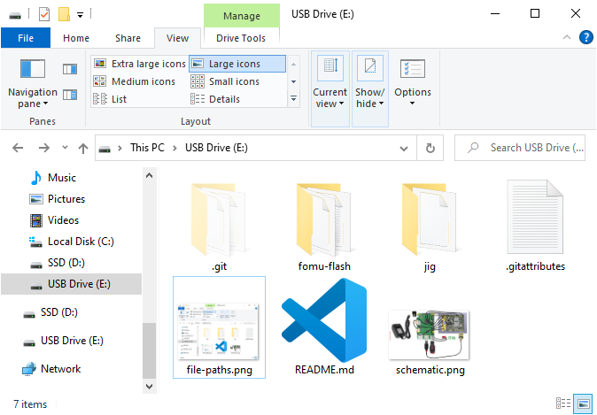

# Qomu Test Jig

This repository contains support files for creating a test jig capable of programming and testing QuickLogic Qomu PCBAs.

## Test Process

The test jig has two LEDs:

1. READY -- the test jig can start a test
2. FAIL -- The device is no good

To prepare the test jig, do the following:

1. Turn on the Test Jig. Wait 20 seconds.
2. Both LEDs will turn on, then FAIL LED will turn off.
   * This is to test both LEDs are working -- If only one LED turns on, then the other is broken.
   * The first time you turn on the test jig, it may take longer than 20 seconds for the LED to turn on.

To test a PCBA, do the following:

1. Insert the Device Under Test into the test jig
2. Close the toggle clamp
3. Press the "Start" button
   * The READY and FAIL LEDs will turn off and the test will begin
4. Wait 30 seconds
   * The test will end early if there is a failure
   * The DUT will flash its LED Red/Blue/Green/Red/Blue/Green. If one color is missing, the device is FAIL.
5.  The READY LED will turn on

If the FAIL LED is on, then the device is no good.

## Setup

1. Construct a test jig according to the following schematic:

2. Download the [latest Exclave Pi SD image](https://github.com/exclave/exclave-pi-gen/releases/latest) and write it to an SD card. On Windows, you can try [Win32 Disk Imager](https://win32diskimager.org/#download)
3. Extract this repository to a USB drive. You can [download this repository as a .ZIP file](archive/refs/heads/main.zip). Make sure this README.md file is at the root of the drive. For example:

4. Insert the USB drive into the Raspberry Pi

## Updating the Test Jig

To update the test jig, simply re-create the USB drive in Step 3 above.

## Obtaining Logs

Remove the USB drive from the Raspberry Pi and insert it into a PC. All tests are written in the file `qomu-test-log.json`.
